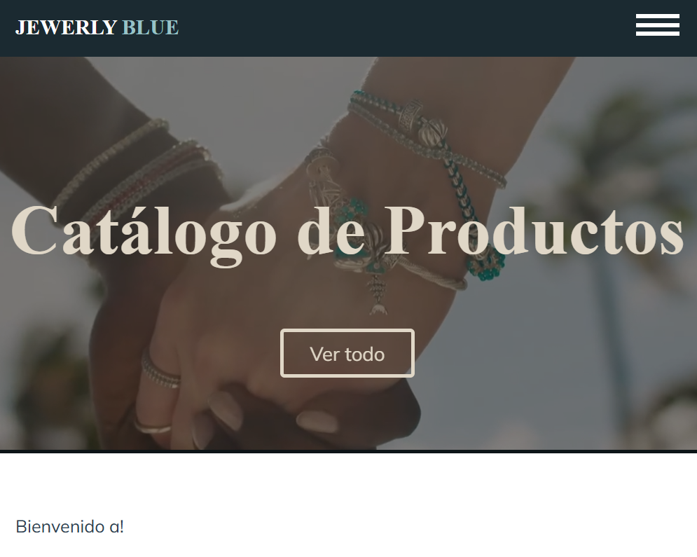
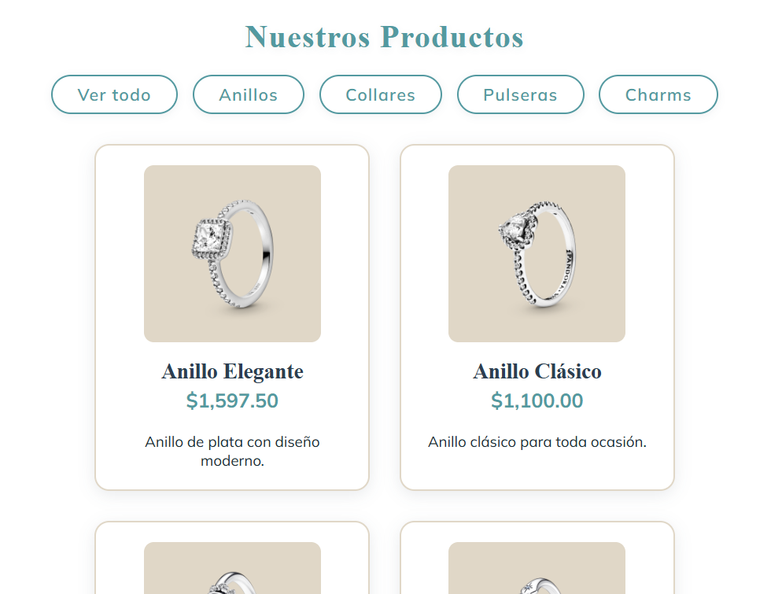

# PORTAFOLIO_PROYECTOS

**Portafolio de proyectos creado para la materia Proyecto Integrador II** Este repositorio presenta una selección de proyectos desarrollados con el objetivo de demostrar habilidades y conocimientos adquiridos durante la formación académica en el área de desarrollo de software.---

## Proyecto 1: Catálogo Web "Jewelry Blue"

**Objetivo:**  
Desarrollar un catálogo web para mostrar productos de joyería de forma visual y organizada.

**Tecnologías utilizadas:**  
HTML, CSS, JavaScript, Google Fonts.

**Descripción:**  
El proyecto consiste en una página web con un catálogo de productos clasificados por categorías como anillos, collares, pulseras y charms. Incluye un menú de navegación, un encabezado con video y una sección de contacto.

**Rol en el proyecto:**  
Desarrollo completo del sitio web, incluyendo estructura HTML, estilos CSS y funcionalidad básica con JavaScript.

**Aprendizajes obtenidos:**  
Se reforzó el uso de estructuras HTML semánticas, diseño visual y organización de archivos para proyectos web.
### Vista previa

---

## Proyecto 2: SUPI – Sistema Universitario Privado Integral

**Objetivo:**  
Desarrollar una plataforma web privada que permita a los estudiantes consultar y localizar información institucional de los docentes de la Universidad Politécnica de Quintana Roo.

**Tecnologías utilizadas:**  
PHP, MySQL, XAMPP, Visual Studio Code.

**Descripción:**  
Sistema web con autenticación que centraliza la información de los docentes, permitiendo la búsqueda de profesores y la consulta de datos como horarios y correo institucional.

**Rol en el proyecto:**  
Trabajo en equipo.  
Mi participación se centró en el **diseño visual del sistema**, la **creación de mockups** y el **apoyo en pruebas de usabilidad**.

**Aprendizajes obtenidos:** 

Se reforzaron habilidades en diseño de interfaces, experiencia de usuario y colaboración en proyectos académicos.

### Vista previa

### Repositorio del Proyecto 
https://github.com/DanielRoman2006/SUPI/tree/main/SUPI.CLICK

---
## Proyecto 3: Panel de Inventario para Farmacia

**Objetivo:**  
Desarrollar una aplicación web para la gestión de inventario de medicamentos, permitiendo el registro, consulta, edición y eliminación de información de manera segura y organizada.

**Tecnologías utilizadas:**  
PHP, MySQL, HTML, CSS, Bootstrap, JavaScript.

**Descripción:**  
Aplicación web completa con sistema de autenticación de usuarios, manejo de sesiones y conexión a una base de datos. Implementa operaciones CRUD para la gestión de medicamentos y administración de proveedores.
Cuenta con un panel de administración que permite visualizar el inventario, filtrar medicamentos por categoría y gestionar registros de forma eficiente.

**Rol en el proyecto:**  
Trabajo en equipo.  
Mi participación se enfocó en el **desarrollo del frontend**, el diseño de la interfaz del panel de administración y la **realización de pruebas funcionales**.

**Funcionalidades principales:**  
- Inicio y cierre de sesión seguro  
- Registro de medicamentos  
- Edición y eliminación de registros  
- Visualización del inventario  
- Filtrado por categoría  
- Conexión a base de datos MySQL  

**Aprendizajes obtenidos:**  
Se fortalecieron conocimientos en desarrollo web dinámico, manejo de sesiones, bases de datos y trabajo colaborativo.
### Vista previa

---
